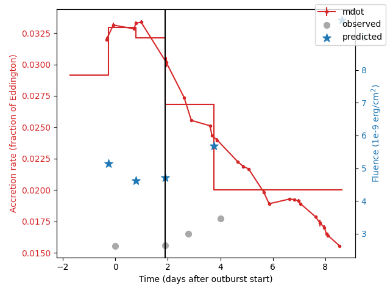
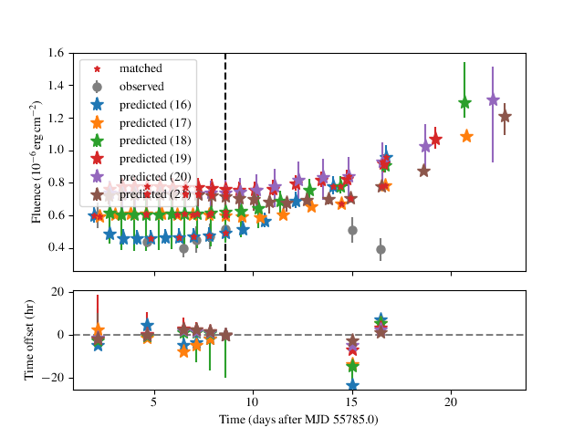
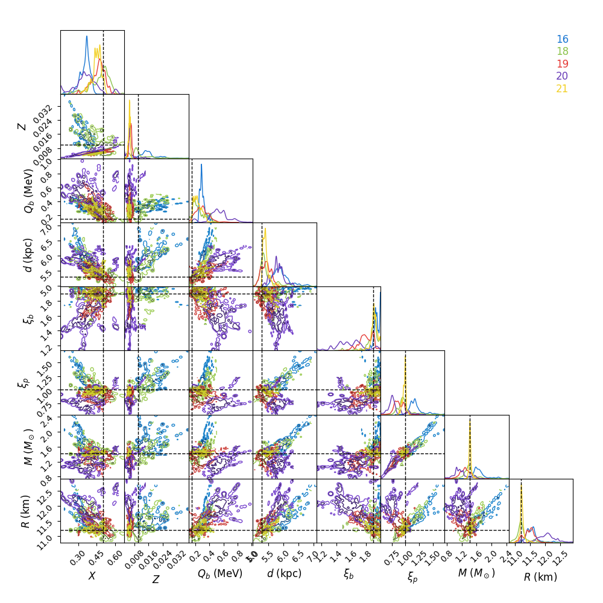

==============
Advanced usage
==============

Here we describe some additional features, options and guidance for the code.

Selecting good starting parameters
----------------------------------

Ideally you want to
start with a set of parameters for your ``theta`` that roughly replicates
the burst observations, including the number, fluence, and recurrence
times.

.. important:: Because of the way the code works in "train" mode, if you
    are too far away from the optimal region of parameter space, the model
    will not even be valid, e.g.  because it doesn't produce enough bursts
    covering the extent of the persistent flux history.

For the "train" mode, the number of bursts simulated can be
adjusted with the ``numburstssim`` and ``ref_ind`` parameters, remembering
that the simulation is performed in both directions (forward and backward
in time) from the reference burst.

The recurrence time (and fluence) can be adjusted most easily
modifying the distance (larger distance implies larger accretion rate at
the same flux, and hence more frequent bursts). You can test the effect of
your trial parameters with the :meth:`beansp.Beans.plot` method,
which produces a plot like so:

In the top panel, the accretion rate (*red dots*, left-hand *y*-axis)
inferred from the persistent flux measurements are
shown, joined by lines implying the use of linear interpolation
(``interp='linear'``) for flux inbetween.
The measured fluence of the observed bursts are indicated (*gray circles*,
right-hand *y*-axis) along with the predicted bursts (*blue stars*).
The time of the reference burst is indicated (*black dashed line*).
For the purposes of simulation the code assumes the accretion rate is
constant between the predicted bursts, which is indicated by the
stepped red line. 

The lower panel shows the time offset between the predicted and observed
bursts.  In this example the times of the bursts are reproduced
reasonably well (the second burst doesn't count, as its our reference from
which the simulation is performed in each direction). There are two
intermediate simulated burst falling between the first and second observed
bursts, but there is also a net trend in the residuals.  So our overall burst
rate is a little low (and the fluences are too high). Even so, the
agreement *might* be good enough to use the chosen ``theta`` as a starting
point. 

Note that the lower panel will not be shown if it's not possible to match
the observed and predicted bursts (e.g. if there are not sufficient
predicted bursts) or if you pass  the option ``show_model=False`` to 
the :meth:`beansp.Beans.plot` method.

Even if the model with the initial parameter set is valid, care must be
taken as the parameter space can be multi-modal and so different starting
points may converge to different locales. Some fine-tuning may be
required.

Burst train options
-------------------

By default, "burst train" mode (i.e. where you enter a separate burst and
persistent flux history file, generates contiguous burst trains, in both
directions outwards from the reference burst.

*New in version 3* is the ``continuous`` flag, which when set to ``False``
will allow gaps of arbitrary length in the train. Each closely-spaced
group of bursts will be treated as a separate train, allowing no more than
``maxgap`` missed bursts between any pair.

**Satellite gtis:**
(optional) These are the satellite telescope "good time intervals" (GTIs), specifying
intervals when the telescope was actually observing the source, and so
(for example) can be used to rule out the presence of predicted bursts
within those intervals in which no bursts were detected. The GTIs are
only used for "burst train" mode, and the file should be specified via the
``gtiname`` parameter. The GTIs should be available from the raw telescope data.

The file format should be a tab-separated file with 2 columns: start time of obs, stop time of obs (both in MJD).
An example distributed with the code is
``data/1808_gti.txt``.

Because the predicted burst times can vary, the present approach of
strictly excluding runs if any predicted bursts fall within GTIs is almost
certainly too restrictive. Future work may include implementing a more
probabilistic approach to penalise models featuring missed bursts within
intervals of high observational duty cycle.

Ensemble mode options
---------------------

The default model choice is ``settle``, but from 
version 3 there  is now the ability to define a model on a grid, for example
from the analysis of bursts from GS 1826-24 by `Johnston et al. (2020)`_.
This version also requires the ``multiepoch_mcmc`` package, available at
https://github.com/zacjohnston/multiepoch_mcmc

.. _Johnston et al. (2020): https://ui.adsabs.harvard.edu/abs/2020MNRAS.494.4576J

.. _parameter-description:

Parameter description
---------------------

Below we list in full the various parameters.

- **run_id**
  A string identifier to label each code run you do.  It can include the location that the chains and analysis are saved. E.g.  if I were modelling SAX J1808.4--3658 I would choose something like ``run_id = "1808/test1"``.  If the package is installed as recommended, you can run the code from within the directory in which you wish to store the output The ``run_id`` will also specify the name of the ``.ini`` file that will be saved as a record of the run parameters, and can be used to restart/redo the run by initialising a new :class:`beansp.Beans` object via the ``config_file`` parameter

- **burstname**
  (required) Path to burst data file. Should be a string, e.g.  ``beans/data/1808_bursts.txt``

- **obsname**
  Path to observation data file. Should be a string, e.g.  ``beans/data/1808_obs.txt``. Set to ``None`` to trigger an "ensemble" run

- **gtiname**
  Path to GTI data file. Should be a string, e.g.  ``beans/data/1808_gti.txt``. Set to ``None`` (the default) to turn off GTI checking

- **theta**
  Sets the initial location of your walkers in parameter space. 

- **ref_ind**
  Index of the adopted reference burst, for "burst train" mode. In this mode the code simulates the burst train both forward and backward in time, so the reference burst should be in the middle of predicted burst train; don't forget Python indexing starts at 0. This burst will not be simulated but will be used as a reference to predict the times of other bursts.

- **numburstssim**
  In "burst train" mode, this is the number of bursts to simulate *in each direction* from the reference burst; i.e. set to roughly half the number of bursts you want to simulate, to cover your entire observed train. Don't forget to account for missed bursts!  In "burst ensemble" mode this is just the number of bursts, so set as equal to the number of bursts observed.

- **bc**
  Bolometric correction to apply to the persistent flux measurements, in "burst train" mode. If they are already bolometric estimates just set this to 1.0.

- **interp**
  Interpolation method to average the persistent flux between bursts; options are ``linear`` (the default) and ``spline``. If the latter is chosen, you can also define the smoothing length with the **smooth** parameter (defaults to ``0.02``)

- **test_model**
  Set to ``False`` to skip the model test on init; default is ``True``

- **threads**
  This is required because the MCMC chains are run in parallel, so you need to specify how many threads (or how many cores your computer has) that will be used.

- **restart**
  If your run is interrrupted and you would like to restart from the save file of a previous run with the ``run_id`` set above, set this to ``True``.  Can also be used if your max step number was not high enough and the chains did not converge before the run finished if you want to start where it finished last time. If this is a new run, set this to ``False``.

- **config_file**
  Read in the parameters from the named file (``.ini`` extension) rather than specifying by hand

Some additional parameters can be used to control the behaviour of the
sampler:

- **sampler**
  The sampler you want to use. The default is ``emcee``, but you can also use ``dynesty`` provided ``bilby`` is also installed (experimental)

- **nwalkers**
  The number of walkers you want the ``emcee`` algorithm to use. Something around 200 should be fine. If you are having convergence issues try doubling the number of walkers - check out the `emcee <https://emcee.readthedocs.io>`_ documentation for more information.

- **nsteps**
  The desired number of steps the ``emcee`` algorithm will take. Every 100 steps the code checks the autocorrelation time for convergence and will terminate the run if things are converged. So you can set nsteps to something quite large (maybe 10000), but if things are not converging the code will take a very long time to run.

- **nlive** 
  The number of "live" points for the ``dynesty`` sampler.

- **dlogz**
  The convergence criterion for the ``dynesty`` sampler.

- **prior**
  Use the specified function in place of the default prior; an example which can be adapted to different sources is :func:`beansp.beans.prior_1808`

- **corr**
  Use the specified function to modify the results from ``pySettle``; an example is :func:`beansp.beans.corr_goodwin19`

- **alpha**
  Set to ``False`` to ignore the ``alpha`` measurements in the likelihood; default is ``True``

- **fluen**
  Set to ``False`` to ignore the ``fluen`` measurements in the likelihood; default is ``True``

Managing the MCMC runs
----------------------

The multi-dimensional parameter spaces within which beansp operates can
make for less-than-ideal behaviour of the walkers, often leading to
multimodal posteriors where some of the modes have much poorer agreement
with the data.

Practically it's useful to start with a few shorter runs to verify the
operation, e.g. trying different starting positions, checking that the chains are evolving in a plausible
direction (with the ``chain`` option in :ref:`analysis`). 

Once you have a preliminary run that you would like to continue, you can
do so by setting ``restart=True`` in the :class:`beansp.Beans` object.
This will automatically continue from the last walker position, appending
the new results to the existing ``.h5`` file.

More fine-control of the walker positions is possible with the 
:meth:`beansp.Beans.prune` method, and using the modified positions as
input to the next stage of the run.

A new set of positions can be provided via 
the ``pos``
option to :meth:`beansp.Beans.do_run`:

.. code-block:: python

    B.do_run(pos=custom_positions)

This option will use the supplied
array (dimension ``nwalkers`` x ``ndim``) as the starting points.

``custom_positions`` can also be a string with the file name of a pickle
file containing the desired start point array.

**Checking Chain Convergence**

There are two main methods of checking the convergence and behaviour of
your ``emcee`` chains. One is the autocorrelation time, which ``emcee``
conveniently calculates for you, and the other is the acceptance fraction.
`Goodman and Weare (2010) <https://msp:.org/camcos/2010/5-1/p04.xhtml>`_
provide a good discussion on what these are and why they are important;
see also the `tutorial with emcee <https://emcee.readthedocs.io/en/stable/tutorials/autocorr>`_. 

Running ``B.do_analysis(['autocor'])`` (see below) will display the integrated
autocorrelation time and the estimates from ``emcee``.

**Observed-predicted burst time comparisons**

The ``comparison`` analysis option behaves in a special way, which affects
some of the other analyses. Depending on the run, in "train" mode you may
have different numbers of predicted bursts for different walker positions.
The ``comparison`` analysis will group these and plot their burst
statistics separately, to help you gauge which is the best option to
pursue (for example). 

An extreme example is shown for a run for IGR J17498-2921 above, where
there are 6 different solution sets with different numbers of predicted
bursts. The relative agreement can be gauged in the residual plot in the
lower panel,
as well as the RMS offset between the predicted and observed bursts, which
is displayed for each model. In this case the 21-burst solution is the
preferred one, with an RMS error of only 1.92 hr.

The different solutions corresponding to different burst numbers are
retained in the posterior object, so that if you subsequently call the
``posteriors`` option in :meth:`beansp.Beans.do_analysis` the posteriors
will also be plotted separately for each different group. For the extreme
case above the posteriors get rather busy...

To "home in" on the best solution you could recover the last set of
samples and choose only those walkers fitting the 21-burst solution:

.. code-block:: python

    p, *dummy = B.reader.get_last_sample()
    np.shape(p)
    (200, 8)
    good = np.array(B.model_pred['partition'])[-200:] == 21
    len(np.where(good)[0])
    39

Only 39 samples are not so many to continue with the run, but you could
use them as a starting point and distribute new walkers around them, and
continue the runs from these positions using the ``pos`` 
option to :meth:`beansp.Beans.do_run` (see above).

You can also set up such a "partition" manually with the use of the
``part`` option for the comparison call.

