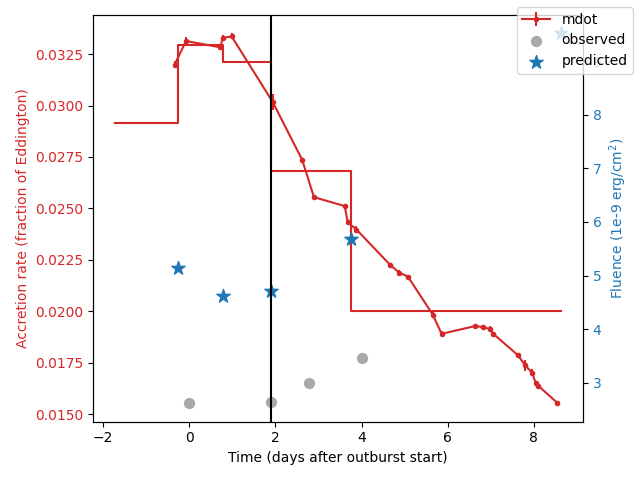
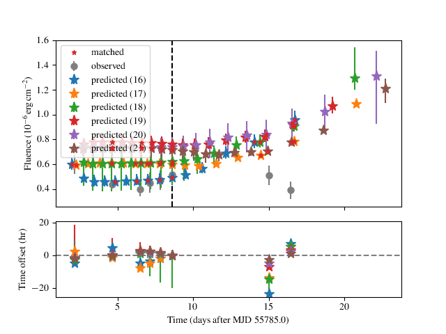
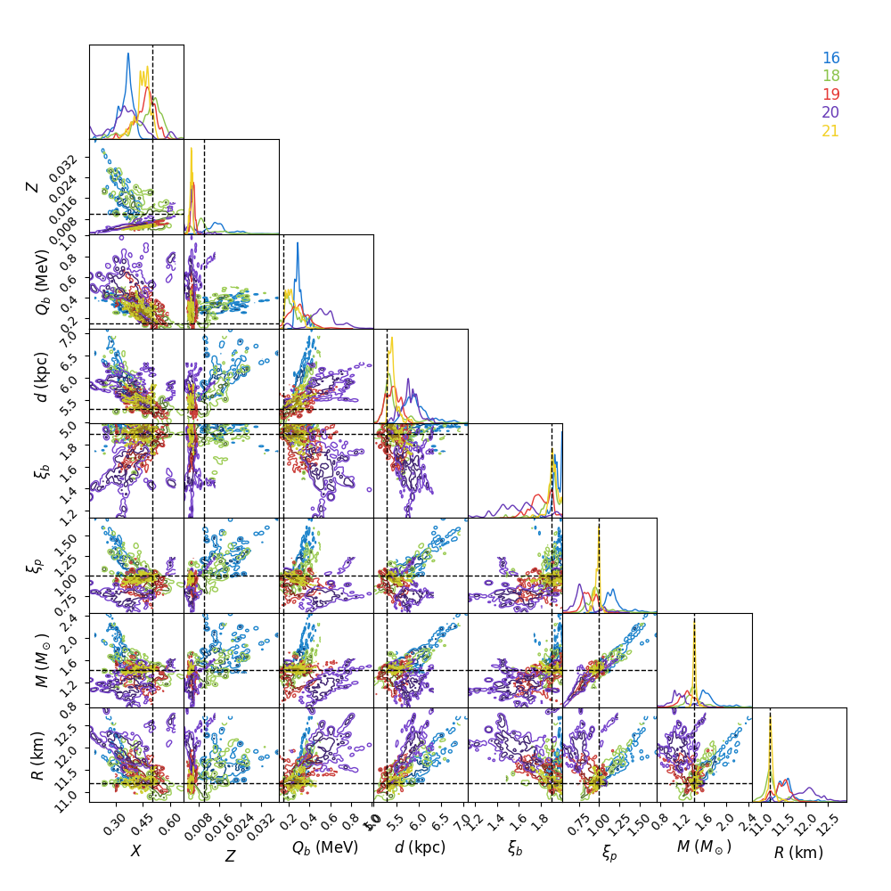

=====
Usage
=====

To use beans, there are a few steps you need to follow:

1. Collect all of the required observational data in the correct format and put it in beans/data folder.
2. Choose all of the initial conditions and initialise the class object :class:`beansp.Beans`.
3. Run the code!
4. Analyse the results

1. Observational data
---------------------

The code has two modes of operation: "burst train" mode, and "ensemble"
mode.

"Burst train" mode takes an uninterrupted (as much as possible) sequence
of X-ray bursts, e.g. from a single outburst of a source. The measured
properties of the bursts and the persistent flux covering the outburst are
supplied in ascii format files, usually in the ``beans/data`` folder. There
are 3 types of input data files, some of which are optional:
burst properties, persistent flux history, and satellite gtis.

"Ensemble" mode takes multiple sets of regular burst measurements, for
example as provided in `Galloway et al. (2017)`_.  The burst measurements,
along with the persistent flux, are all supplied in the burst properties file, and the other two files are not required

.. _Galloway et al. (2017): https://ui.adsabs.harvard.edu/abs/2017PASA...34...19G

**Burst observations:**
Required for both modes, and set via the ``burstname`` parameter; for "burst train" mode, ascii format, with columns in the following order:
time (MJD), bolometric burst fluence (in units of
:math:`10^{-6}\ \rm{erg\,cm^{-2}}`),
fluence error, alpha, alpha
error. For "ensemble" mode, the columns are
time (MJD), fluence (in :math:`10^{-6}\ \rm{erg\,cm^{-2}}`),
fluence error, alpha, alpha
error, (bolometric) persistent flux
(:math:`10^{-9}\ \rm{erg\,cm^{-2}\,s^{-1}}`),
persistent flux error, recurrence time (hr), recurrence time error

**Persistent flux history:**
Required for "burst train" mode, set via the ``obsname`` parameter; set to
``None`` for "ensemble" mode runs.
Ascii format, with columns in the following order:
start time (MJD), stop time (MJD) persistent flux measurements (in 
:math:`10^{-9}\ \rm{erg\,cm^{-2}\,s^{-1}}`),
pflux error

**Satellite gtis:**
(optional) These are the satellite telescope "good time intervals" (GTIs), specifying
intervals when the telescope was actually observing the source, and so
(for example) can be used to rule out the presence of predicted bursts
within those intervals in which no bursts were detected. The GTIs are
only used for "burst train" mode, and the file should be specified via the
``gtiname`` parameter. The GTIs should be available from the raw telescope data. The file format should be a tab-separated file with 2 columns: start time of obs, stop time of obs (both in MJD).

Once you have collected the required data in the correct format and placed it in the beans/data/ folder, you can move on to initialisation.

2. Initialisation
-----------------

Initialisation is done by instantiating a :class:`beansp.Beans` object (a "bean", why
not). The parameters you might normally
need to specify are listed below.

Example initialisation would be something like:

.. code-block:: python

    from beansp import Beans

    B = Beans(nwalkers=200, nsteps=100, run_id="1808/test1", 
        obsname='1808_obs.txt', burstname='1808_bursts.txt', 
        theta= (0.58, 0.013, 0.4, 3.5, 1.0, 1.0, 1.5, 11.8, 1.0, 1.0), 
        numburstssim=3, bc=2.21, ref_ind=1, threads = 4, restart=False)

The code should display some information to the terminal that will tell you if reading in the observation data and testing the model was successful. 

**Note** that following each run the code will save the settings in a file
``<run_id>.ini`` which serves as a record, along with the ``.h5`` file
that stores the chains and model evaluations. If you're restarting or
re-running the same experiment you can use the ``config_file`` option to
replicate:

.. code-block:: python

    from beansp import beans,Beans
    B = Beans(config_file="test1.ini", prior=beans.prior_1808,corr=beans.corr_goodwin19)
    B.restart = True
    B.nsteps = 1000
 
In the example given above we're reading in all the parameters from the
previous ``test1`` run, but updating the number of steps, to go longer this
time (for example).

Note also the specification of the ``prior`` and ``corr`` functions; these
settings replicate the baseline run for SAX J1808.4-3658.

**It is important to choose good starting parameters** The
MCMC walkers will be distributed tightly around a starting point given by
the ``theta`` parameter, which includes each of the input parameters to the model:

.. code-block:: python

    theta = X, Z, Q_b, d, xi_b, xi_p, M, R [, f_E, f_a]

(the square brackets indicate that ``f_E`` and ``f_a`` are optional). 

So an example set of starting conditions would be:

.. code-block:: python

    theta = 0.36, 0.016, 0.8, 2.4, 1.0, 1.4, 2.1, 12.2

The ``f_E`` and ``f_a`` in this case are not included; see parameters for a description of each of the parameters.

Ideally you want to
start with a set of parameters for your ``theta`` that roughly replicates
the burst observations, including the number, fluence, and recurrence
times. For the 'train' mode, the number of bursts simulated can be
adjusted with the ``numburstssim`` and ``ref_ind`` parameters, remembering
that the simulation is performed in both directions (forward and backward
in time) from the reference burst.
The recurrence time (and fluence) can be adjusted by
modifying the distance (larger distance implies larger accretion rate at
the same flux, and hence more frequent bursts). You can test the effect of
your trial parameters with the :meth:`beansp.Beans.plot` method,
which produces a plot like so:

In the top panel, the accretion rate (*red dots*, left-hand *y*-axis)
inferred from the persistent flux measurements are
shown, joined by lines implying the use of linear interpolation
(``interp='linear'``) for flux inbetween.
The measured fluence of the observed bursts are indicated (*gray circles*,
right-hand *y*-axis) along with the predicted bursts (*blue stars*).
The time of the reference burst is indicated (*black dashed line*).
For the purposes of simulation the code assumes the accretion rate is
constant between the predicted bursts, which is indicated by the
stepped red line. 

The lower panel shows the time offset between the predicted and observed
bursts.  In this example the times of the bursts are reproduced
reasonably well (the second burst doesn't count, as its our reference from
which the simulation is performed in each direction). There are two
intermediate simulated burst falling between the first and second observed
bursts, but there is also a net trend in the residuals.  So our overall burst
rate is a little low (and the fluences are too high). Even so, the
agreement *might* be good enough to use the chosen ``theta`` as a starting
point. 

Note that the lower panel will not be shown if it's not possible to match
the observed and predicted bursts (e.g. if there are not sufficient
predicted bursts) or if you pass  the option ``show_model=False`` to 
the :meth:`beansp.Beans.plot` method.

Each of the initialisation parameters are described in more detail below:

- **nwalkers**
  The number of walkers you want the MCMC algorithm to use. Something around 200 should be fine. If you are having convergence issues try doubling the number of walkers - check out the `emcee <https://emcee.readthedocs.io>`_ documentation for more information.

- **nsteps**
  The desired number of steps the MCMC algorithm will take. Every 100 steps the code checks the autocorrelation time for convergence and will terminate the run if things are converged. So you can set nsteps to something quite large (maybe 10000), but if things are not converging the code will take a very long time to run.

- **run_id**
  A string identifier to label each code run you do.  It can include the location that the chains and analysis are saved. E.g.  if I were modelling SAX J1808.4--3658 I would choose something like ``run_id = "1808/test1"``.  If the package is installed as recommended, you can run the code from within the directory in which you wish to store the output The ``run_id`` will also specify the name of the ``.ini`` file that will be saved as a record of the run parameters, and can be used to restart/redo the run by initialising a new :class:`beansp.Beans` object via the ``config_file`` parameter

- **obsname**
  Path to observation data file. Should be a string, e.g.  ``beans/data/1808_obs.txt``. Set to ``None`` to trigger an "ensemble" run

- **burstname**
  (required) Path to burst data file. Should be a string, e.g.  ``beans/data/1808_bursts.txt``

- **theta**
  Sets the initial location of your walkers in parameter space. 

- **numburstssim**
  In "burst train" mode, this is the number of bursts to simulate *in each direction*. I.e. set to roughly half the number of bursts you want to simulate, to cover your entire observed train. Don't forget to account for missed bursts!  In "burst ensemble" mode this is just the number of bursts, so set as equal to the number of bursts observed.

- **bc**
  Bolometric correction to apply to the persistent flux measurements, in "burst train" mode. If they are already bolometric estimates just set this to 1.0.

- **ref_ind**
  Index of the adopted reference burst, for "burst train" mode. In this mode the code simulates the burst train both forward and backward in time, so the reference burst should be in the middle of predicted burst train; don't forgot Python indexing starts at 0. This burst will not be simulated but will be used as a reference to predict the times of other bursts.

- **threads**
  This is required because emcee runs in parallel, so needs to know how many threads (or how many cores your computer has) that it can run on. 

- **restart**
  If your run is interrrupted and you would like to restart from the save file of a previous run with the ``run_id`` set above, set this to ``True``.  Can also be used if your max step number was not high enough and the chains did not converge before the run finished if you want to start where it finished last time. If this is a new run, set this to ``False``.

Some additional parameters can be used to control the behaviour of the
sampler:

- **config_file**
  Read in the parameters from the named file (``.ini`` extension) rather than specifying by hand

- **gtiname**
  Path to GTI data file. Should be a string, e.g.  ``beans/data/1808_gti.txt``. Set to ``None`` (the default) to turn off GTI checking

- **prior**
  Use the specified function in place of the default prior; an example which can be adapted to different sources is :func:`beansp.beans.prior_1808`

- **corr**
  Use the specified function to modify the results from ``pySettle``; an example is :func:`beansp.beans.corr_goodwin19`

- **interp**
  Interpolation method to average the persistent flux between bursts; options are ``linear`` (the default) and ``spline``. If the latter is chosen, you can also define the smoothing length with the **smooth** parameter (defaults to ``0.02``)

- **alpha**
  Set to ``False`` to ignore the ``alpha`` measurements in the likelihood; default is ``True``

- **fluen**
  Set to ``False`` to ignore the ``fluen`` measurements in the likelihood; default is ``True``

- **test_model**
  Set to ``False`` to skip the model test on init; default is ``True``

If there are no errors or other issues here, move on to running the code.

3. Running the Code
-------------------

Once you have initialised the :class:`beansp.Beans` object and ensured all the data is
available, you are ready to go. Running the code is done with the following command:

.. code-block:: python

    B.do_run()

If all is well you will see a progress bar appear which will give you an idea of how long the run is going to take.

When you see ``Complete! Chains are converged`` this means the run finished, and the chains were converged.

When you see ``Complete! WARNING max number of steps reached but chains
are not converged.`` This means the run finished but reached the maximum
number of steps ``nsteps`` without converging.

Practically it's useful to start with a few shorter runs to verify the
operation, e.g. checking that the chains are evolving in a plausible
direction (with the ``chain`` option below). 

Once you have a preliminary run that you would like to continue, you can
do so by setting ``restart=True`` in the :class:`beansp.Beans` object.
This will automatically continue from the last walker position, appending
the new results to the existing ``.h5`` file.

More fine-control of the walker positions is possible with the ``pos``
option to :meth:`beansp.Beans.do_run`:

.. code-block:: python

    B.do_run(pos=custom_positions)

This option will use the supplied
array (dimension ``nwalkers`` x ``ndim``) as the starting points.

**Checking Chain Convergence**

There are two main methods of checking the convergence and behaviour of
your MCMC chains. One is the autocorrelation time, which ``emcee``
conveniently calculates for you, and the other is the acceptance fraction.
`Goodman and Weare (2010) <https://msp.org/camcos/2010/5-1/p04.xhtml>`_
provide a good discussion on what these are and why they are important;
see also the `tutorial with emcee <https://emcee.readthedocs.io/en/stable/tutorials/autocorr>`_. 

Running ``B.do_analysis(['autocor'])`` (see below) will display the integrated
autocorrelation time and the estimates from ``emcee``.

4. Analysing the Results
------------------------

The output of the MCMC algorithm is saved in HDF5 format, and will be
located in whichever folder you chose when you set ``run_id``. For initial analysis of the chains you can run:

.. code-block:: python

    B.do_analysis()

And it will create a plot showing the estimated autocorrelation times
throughout the run, as well as the posterior distributions of your
parameters.

Typically you will omit the initial "burn-in" phase and only use the
walker positions in the later part of the run; you can specify how many
steps to skip with the ``burnin`` parameter.

The model predictions at each step are saved in the "blobs" part of the sampler, which are used together with the parameter values to display the various plots below. For compatibility with the HDF5 format the model prediction dictionary must be converted to a string, and so it needs to be turned back into a dictionary item-by-item (e.g. with ``eval``) when you read in the save file.

Several other options are possible for built-in analysis, and can be
specified via the ``options`` keyword to :meth:`beansp.Beans.do_analysis`,
which accepts a list of strings, specifying one or more of:

``autocor``
  plot estimates of the autocorrelation times for each parameter, as a function of timestep

``chain``
  plot the first 300 iterations of the chains

``posteriors``
  show a "corner" plot giving the distirbution of the raw posteriors of the model parameters

``mrcorner``
  show a "corner" plot with just the neutron star parameters, *M*, *R*, *g* and *1+z*

``fig6``
  replicate Figure 6 from `Goodwin et al. (2019) <https://doi.org/10.1093/mnras/stz2638>`_, a "corner" plot with *xi_b*, *xi_p*, *d*, *Q_b*, *Z*

``fig8``
  replicate Figure 8 from `Goodwin et al. (2019) <https://doi.org/10.1093/mnras/stz2638>`_, plotting *xi_b* vs. *xi_p* and models (where available, via the `concord <https://github.com/outs1der/concord>`_ repository) for comparison',

``comparison``
  plot the observed and predicted burst times and fluences

You can choose to display the figures for each analysis, or save to a PDF
by specifying ``savefig=True`` in the call to
:meth:`beansp.Beans.do_analysis`.

**Observed-predicted burst time comparisons**

The ``comparison`` analysis option behaves in a special way, which affects
some of the other analyses. Depending on the range of walkers, you may
have different numbers of predicted bursts at different walker positions.
The ``comparison`` analysis will group these and plot their burst
statistics separately, to help you gauge which is the best option to
pursue (for example). 

An extreme example is shown for a run for IGR J17498-2921 above, where
there are 6 different solution sets with different numbers of predicted
bursts. The relative agreement can be gauged in the residual plot below,
as well as the RMS offset between the predicted and observed bursts, which
is displayed for each model. In this case the 21-burst solution is the
preferred one, with an RMS error of only 1.92 hr.

The different solutions corresponding to different burst numbers are
retained in the posterior object, so that if you subsequently call the
``posteriors`` option in :meth:`beansp.Beans.do_analysis` the posteriors
will also be plotted separately for each different group. For the extreme
case above the posteriors get rather busy...

To "home in" on the best solution you could recover the last set of
samples and choose only those walkers fitting the 21-burst solution:

.. code-block:: python

    p, *dummy = B.reader.get_last_sample()
    np.shape(p)
    (200, 8)
    good = np.array(B.model_pred['partition'])[-200:] == 21
    len(np.where(good)[0])
    39

Only 39 samples are not so many to continue with the run, but you could
use them as a starting point and distribute new walkers around them, and
continue the runs from these positions using the ``pos`` 
option to :meth:`beansp.Beans.do_run` (see above).

**Obtaining Parameter Constraints**

The model parameter posterior distributions are the most detailed
constraints on your parameters provided by the  MCMC algorithm. However,
you may wish to summarise by giving central values with uncertainties to
report for the parameters. There are a few ways this can be done; e.g.
take the maximum likelihood value and the upper and lower limits
encompassing the desired confidence fraction, or you could take the 50th
percentile value of
the distributions. The analysis code in :meth:`beansp.Beans.do_analysis`
does this one way, but you should always check multiple methods and see if
the results are significantly different.

The central values of these and 1 sigma
uncertainties are saved in the text file
``(run_id)_parameterconstraints_pred.txt``.

The  model predictions include the burst time, fluence, and alpha, which are stored as arrays containing an entry for each of the predicted bursts. These arrays will include as many elements as are chosen via the ``numburstssim`` parameter on initialisation.  The time array has 1 extra element than the fluence and alpha arrays, because the latter parameters do not include predictions for the reference burst (with index ``ref_ind``).
